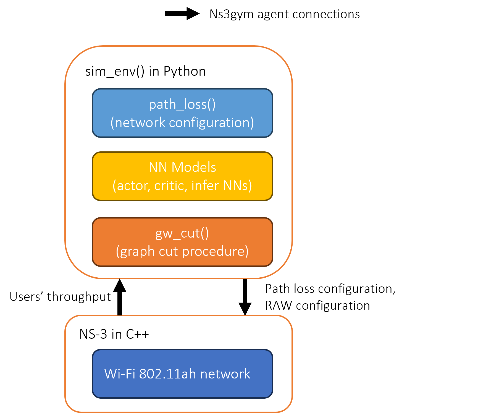

# AC-GRL-WI-FI

Codes for paper, "Graph Representation Learning for Contention and Interference Management in Wireless Networks".

Author: Zhouyou Gu (zhouyou.gu@sydney.edu.au); 

Supervisors: Wibowo Hardjawana (wibowo.hardjawana@sydney.edu.au); Branka Vucetic (branka.vucetic@sydney.edu.au);

Collaborators: Kishore Chikkam and Pasquale Aliberti from Morse Micro, Sydney.

*This project is developed at [Centre for IoT and Telecommunications](https://www.sydney.edu.au/engineering/our-research/internet-of-things/centre-for-iot-and-telecommunications.html) at The University of Sydney, 
supported in part by The University of Sydney’s External Research Collaboration Seed Funding (Morse Micro), Deputy-Vice Chancellor (DVC) Research, in 2022. 
The reference to our paper:*

> ```
>@ARTICLE{gu2024graph,
> author={Gu, Zhouyou and Vucetic, Branka and Chikkam, Kishore and Aliberti, Pasquale and Hardjawana, Wibowo},
> journal={Early access in IEEE/ACM Transactions on Networking}, 
> title={Graph Representation Learning for Contention and Interference Management in Wireless Networks}, 
> year={2024},
> volume={},
> number={},
> pages={1-16},
> doi={10.1109/TNET.2024.3355935}}
> ```


### Package Dependency
The following is a table of packages used in this project. 
Note that packages with different versions may not be compatible in this project. 
Please install the right version based on instructions on their corresponding websites.

*This project needs a modified version of NS-3 and ns3gym [here](https://github.com/zhouyou-gu/ns-3-dev-ac-grl-wi-fi.git). Please install their prerequisites according to their original websites.

(It is recommended to have a GPU for this project, but it can also run on CPU-only PCs.)

| Packages             | Version            |
|:---------------------|--------------------|
| Ubuntu               | 20.04.1            |
| Python               | 3.8.10             |
| CMAKE                | 3.16.3             |
| PyTorch              | 1.12.0+cu116       |
| PyTorch Geometric    | 2.1.0              |
| nvidia-driver (CUDA) | 520.61.05 (11.8)   |




### Installation

In your home directory, git clone this repository as (if you clone the repository in a different place, you may need to change [the path configuration](controller/working_dir_path.py) in this project)
```bash
git clone https://github.com/zhouyou-gu/ac-grl-wi-fi.git
```

Change the working directory to the cloned ac-grl-wi-fi folder. 
```bash
cd ac-grl-wi-fi
```
Run the following to fetch the [NS-3 codes](https://github.com/zhouyou-gu/ns-3-dev-ac-grl-wi-fi.git) for this project.
```bash
git submodule update --init --recursive
```

Change the working directory to [controller](controller)

```bash
cd controller
```

(Optional) Now, you can have a test on whether the codes are correctly connected to the torch installation as 
```bash
PYTHONPATH=./ python3 sim_script/cuda_test.py
```
(Optional) for example, on the computer that we used to generate the simulation results, the above command returns the versions of torch as
```
torch.version 1.12.0+cu116
torch.cuda.is_available() True
torch.cuda.current_device() 0
torch_geometric.__version__ 2.1.0
```

Next, configure and compile NS-3
```bash
PYTHONPATH=./ python3 sim_script/configure_ns3.py
```
```bash
PYTHONPATH=./ python3 sim_script/build_ns3.py
```

To install ns3gym in Python, change the directory back to the repository root 
and then to [ns-3-dev/contrib/opengym](ns-3-dev/contrib/opengym), run

```bash
sudo pip3 install ./model/ns3gym    
```

### Simulations
Set the working directory as [controller](controller).

Run the pre-training of the inference NN in AC-GRL as
```bash
PYTHONPATH=./ python3 sim_src/algorithms/test_model/test_infer.py
```

Run the main training process of AC-GRL as
```bash
PYTHONPATH=./ python3 sim_src/algorithms/test_model/test_itl_mmf_bidirection_interference.py
```

Alternatively, the trained NN in the paper can be evaluated (alone with other compared schemes) as
```bash
PYTHONPATH=./ python3 sim_src/algorithms/eval_model/do_run_test_parallel.py
```

The evaluation of the online fine-tuning architecture is  
```bash
PYTHONPATH=./ python3 sim_src/algorithms/online_finetune/do_run_test_parallel.py
```
